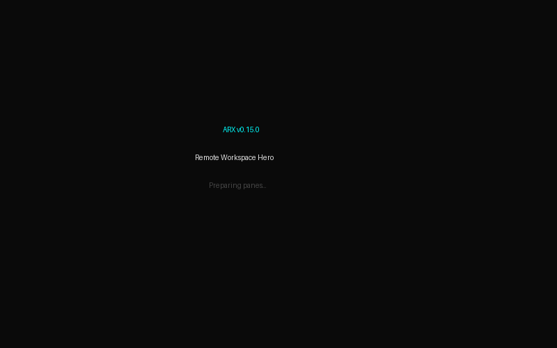

# ARX

Terminal commander for local ↔ remote workspaces on Linux.



**Current release: [v0.24.0](https://github.com/mrAibo/arx/releases/tag/v0.24.0)**

Linux x86_64 · Rust MSRV 1.88 · MIT

Compare before touching anything. Preview the exact consequences. Execute. Verify the real result.

## Why ARX?

- **Local ↔ remote as one workspace.** Work with Local, SFTP, S3, WebDAV, and archives from one dual-pane TUI.
- **Compare before execution.** Workspace diff is a separate fact; a comparison never silently becomes a mutation.
- **Preview exact consequences.** Destructive workspace sync requires a frozen Preview before execution.
- **Truthful background work.** Queue, pause-pending, paused, retry-waiting, cancelled, failed, completed, and verification remain distinct states.
- **Safe remote semantics.** ARX prefers noclobber/staged operations and never blindly replays ambiguous remote mutations.
- **Provider-native identity.** Existing remote resources are addressed by provider truth, not reconstructed display names.
- **Read-only storage intelligence.** `Alt+U` provides truthful Local usage analysis and exact S3 object plus bounded bucket/prefix inspection without inventing filesystem-capacity semantics.

Published **v0.24.0** supports Local → Local, Local → SFTP, SFTP → Local, and **SFTP → SFTP Workspace Sync** from [#269](https://github.com/mrAibo/arx/issues/269) / [#270](https://github.com/mrAibo/arx/pull/270), including same-host and cross-host bounded remote → ARX → remote streaming with real two-endpoint OpenSSH acceptance.

**v0.24.0 retains the read-only S3 Object & Bucket Inspector** shipped in v0.23.0 from [#264](https://github.com/mrAibo/arx/issues/264) / [#265](https://github.com/mrAibo/arx/pull/265), including exact object inspection and bounded bucket/prefix LiveScan analytics.

## Platform support

ARX is intentionally a **Linux application**. The published release target is **Linux x86_64**. Native Windows support is not planned.

When ARX runs inside SSH, the established session environment is authoritative. ARX preserves an existing `DISPLAY` but never invents one; X11 forwarding must already be provided by the SSH client/session.

## Install v0.24.0

Published binaries and packages live under **GitHub Releases**, not in the source tree. The repository intentionally does not track a current `bin/arx` copy.

Download your preferred artifact and `SHA256SUMS` from the [v0.24.0 release](https://github.com/mrAibo/arx/releases/tag/v0.24.0).

Verify downloaded artifacts:

```bash
sha256sum --ignore-missing -c SHA256SUMS
```

### Debian / Ubuntu

```bash
sudo apt install ./arx_0.24.0_amd64.deb
```

### Fedora / RHEL family

```bash
sudo dnf install ./arx-0.24.0-1.x86_64.rpm
```

### Portable tarball

```bash
tar xzf arx-v0.24.0-x86_64-unknown-linux-gnu.tar.gz
sudo install -m 755 arx-v0.24.0-x86_64-unknown-linux-gnu/arx /usr/local/bin/arx
arx --version
```

Expected output:

```text
arx 0.24.0
```

Release bundles include the MIT license and generated third-party license notices. Native packages install documentation under `/usr/share/doc/arx`.

### From source

Rust 1.88+ and system OpenSSH are required. The built-in **Compress to tar.gz** Quick Action additionally requires a system `tar` executable.

```bash
cargo install --git https://github.com/mrAibo/arx
arx
```

## 60-second Remote Workspace workflow

1. Put the source workspace in one pane and the destination in the other, for example `~/code/app` and an SFTP host path.
2. Press **Ctrl+D** to compare both roots.
3. Press **Ctrl+X P** to open Workspace Sync Preview.
4. Review the frozen plan and choose Update or Mirror deliberately.
5. Press **Enter** to execute through the existing Job Manager / Transfer Queue.
6. After completion, ARX performs a separate verification scan.
7. Trust the final verdict: `Synchronized`, `DifferencesRemain`, or `Inconclusive`.

## Key capabilities

| Area | Current product truth |
|---|---|
| Dual-pane TUI | Tabs, history, swap, mouse, split panes |
| Split panes | Vertical + horizontal, explicit close, keyboard ratio resize (20–80), section-aware same-location mouse behavior |
| Local / SFTP | Browsing, transactional file copy, SFTP bounded preview, conflict-safe text Remote Edit |
| Transfer Queue | Bounded FIFO, concurrency 1..=8, progress/rate/ETA where known, Pause/Resume/Cancel, safe retry ≤3 attempts |
| Transfer Center | Active / History / All views with runtime-owned controls |
| Workspace Sync | Compare → Preview → Execute → Verify; v0.24.0 covers Local→Local, Local↔SFTP, and same-host/cross-host SFTP→SFTP sync |
| Storage Inspector (`Alt+U`) | Local: read-only `du++`-style logical/allocated usage, drill-down/top files/cancellation. S3: exact object inspection plus bounded paginated bucket/prefix LiveScan analytics |
| Filesystems | Read-only Linux `df++`-style capacity/inode view; S3 never receives fake `df` semantics |
| Effective keymap | Conflict-safe user overrides + `arx --print-keymap` |
| Quick Actions | Typed local SHA-256, Touch, Compress to tar.gz; existing mkdir/chmod/symlink surface retained |
| Embedded terminal | Built-in terminal plus hardened tmux / GNU Screen lifecycle |
| S3 | AWS S3 + MinIO physically accepted; v0.24.0 retains the exact Object & Bucket/Prefix Inspector shipped in v0.23.0; Moto emulated; R2/Wasabi best-effort/unverified |
| WebDAV | Apache mod_dav + Nextcloud 34.0.2 + ownCloud 11.0.0 physically accepted with Basic auth |
| Packages | tar.gz + `.deb` + `.rpm` + one `SHA256SUMS`, all published from one validated ELF |
| Extension surface | `arx.menu`; no embedded Lua/WASM/native plugin runtime |

## File operations

| Key | Action |
|---|---|
| **F3** | View — Local full preview; SFTP bounded text; S3 bounded object preview; WebDAV bounded one-file preview |
| **F4** | Edit — Local editor; SFTP conflict-safe text edit; S3/WebDAV disabled |
| **F5** | Copy — Local↔Local, Local↔SFTP, Local↔S3 single object, Local↔WebDAV file/tree copy; WebDAV↔Local supports multiple selected sibling roots as one queued job |
| **F6** | Move — Local↔Local product path; S3 disabled; cross-target WebDAV move unsupported |
| **F7** | Create directory — Local/SFTP, S3 prefix marker, WebDAV MKCOL |
| **F8** | Delete — Local trash; confirmed SFTP delete; exact S3 object / proven-empty marker delete; WebDAV supports safe bounded recursive delete for one exact selected collection |
| Shift+F6 | Rename |
| Ctrl+U | Swap panes |
| Ctrl+X C / L / O / S | chmod / hardlink / chown / symlink |
| Ctrl+\\ | Toggle split pane |

## S3 Object & Bucket Inspector in v0.23.0

v0.23.0 adds read-only S3 storage intelligence without treating object storage like a POSIX filesystem.

### Exact object inspection

For one exact provider-native S3 object, ARX uses `HeadObject` and shows only facts the backend actually returns: target/bucket/key identity, size, last modified, ETag, content type, storage class, metadata, endpoint override, and version ID when available. Missing values remain unavailable rather than being synthesized.

### Bounded bucket / prefix inspection

Bucket and prefix inspection uses paginated `ListObjectsV2` LiveScan evidence with progress and cooperative cancellation. It reports observed object count, logical bytes, bounded largest-object ranking, bounded immediate-prefix ranking, age distribution, and storage-class distribution. Prefix and storage-class cardinality are explicitly bounded so large or unusual S3-compatible backends cannot turn the inspector into an unbounded in-memory inventory.

The implementation reuses the existing `ProviderRegistry`, per-target `S3Provider`/AWS client, `JobManager`, and UI authority. It does not create a second scheduler, registry, client cache, or mutation path.

Physical acceptance on the merged implementation includes a real MinIO path proving exact object inspection and prefix inspection. AWS S3 remains the supported product path; Cloudflare R2 and Wasabi remain best-effort/unverified until separately evidenced.

## WebDAV in v0.22.0

v0.22.0 expands the recursive WebDAV surface while keeping the same planner/queue/provider authorities and the same exact-identity safety model.

### Recursive WebDAV → Local download

One selected WebDAV collection can be copied to one new Local directory tree. ARX uses exact server-returned href identities, bounded authenticated `PROPFIND Depth: 1`, complete manifest validation before Local mutation, staged noclobber downloads, and truthful cleanup/recovery outcomes.

### Recursive Local → WebDAV upload

One Local directory can be copied as one new remote tree. ARX pre-scans the Local tree, rejects symlinks/special/unsafe names, uses bounded depth/count limits, root-relative no-follow reads, destination-root noclobber semantics, and recovery-required classification for ambiguous remote mutation outcomes.

### Safe recursive WebDAV delete

One exact selected WebDAV collection can be deleted recursively. ARX builds and revalidates a complete bounded manifest, deletes deepest-first/root-last, performs a fresh exact empty proof before each collection DELETE, and never retries ambiguous destructive requests automatically.

### Multi-root F5 Copy

Multiple selected current sibling roots can be copied as one queued job in both Local → WebDAV and WebDAV → Local directions. Mixed files/directories are supported. Roots execute sequentially, progress is reported at root granularity, and earlier completed roots remain truthful if a later root fails or is cancelled.

Physical acceptance for the same product path:

| Backend | Status |
|---|---|
| Apache mod_dav | ✅ W1–W18 + recursive download/upload/delete + destructive safety + multi-root F5 |
| Nextcloud 34.0.2-apache | ✅ I1–I12 + recursive download/upload/delete + multi-root F5 |
| ownCloud 11.0.0 | ✅ I1–I12 + recursive download/upload/delete + multi-root F5 |

Still intentionally unsupported: multi-root recursive WebDAV delete, WebDAV→WebDAV recursive/cross-target copy or move, Digest/Bearer auth, and metadata/property mutation. See [#13](https://github.com/mrAibo/arx/issues/13).

## Navigation and discovery

| Key | Action |
|---|---|
| j / ↓ / k / ↑ | Move cursor |
| Enter | Enter directory / archive / content diff |
| Backspace | Parent / exit archive |
| Tab | Switch active pane |
| Ctrl+G | Go to path |
| Ctrl+H | Toggle hidden files |
| Alt+Down / Alt+Up | Directory history |
| Space | Toggle selection |
| Shift+Left-click | Inclusive real-row range selection |
| Right-click | Provider-aware typed context menu |
| Ctrl+P | Command Center |
| Ctrl+J | Jobs |
| Ctrl+Y | Transfer Center |
| Alt+U | Storage Inspector — Local usage or S3 object/bucket/prefix inspection |
| Alt+D | Filesystems |
| Ctrl+X T | Embedded Terminal |
| ? | Help |

The runtime keymap is authoritative. Inspect the effective bindings with:

```bash
arx --print-keymap
```

## Configuration

### `~/.config/arx/arx.toml`

```toml
[ui]
show_hidden = false
editor = "hx"

[transfer]
concurrency = 2
```

Transfer concurrency defaults to 2 and must remain within `1..=8`.

### Configurable keybindings

```toml
[[keybindings]]
context = "browser"
action = "open_storage_inspector"
keys = "F11"

[[keybindings]]
context = "browser"
action = "open_smart_tree"
disabled = true
```

Exactly one of `keys` or `disabled = true` is required per entry. Duplicate or prefix-conflicting sequences inside one input context fail configuration instead of silently choosing a winner. Only KeyRouter-managed action/context pairs are configurable.

### `~/.config/arx/hosts.toml`

```toml
[[hosts]]
id = "nuc"
name = "Headless NUC"
hostname = "192.168.1.10"
user = "aibo"
default_path = "/home/aibo"
```

Hosts use the user's OpenSSH configuration, including aliases, ProxyJump, IdentityFile, custom ports, host-key policy, and agent behavior.

### `~/.config/arx/arx.menu`

```text
t  "Tar home"  tar czf /tmp/home.tgz ~/
t  "Disk usage"  df -h
```

`arx.menu` is the supported lightweight admin extension surface. ARX does not ship an embedded Lua, WASM, or native plugin runtime.

## Safety model

- Destructive workspace sync requires Preview.
- Provider-native identity is authoritative; display names do not reconstruct remote addresses.
- Transfer retries are phase-aware and bounded; ambiguous remote mutations and recovery-required outcomes are not blindly replayed.
- WebDAV automatic HTTP mutation retries remain disabled.
- Secrets stay in OS keyring/environment rather than plaintext target config.
- Long-running operations reuse the existing Effect / Job / Transfer Queue authorities instead of creating parallel schedulers or lifecycle models.
- S3 remains object storage; ARX does not fabricate POSIX filesystem-capacity semantics for it.

## Development

```bash
cargo fmt --check
cargo check --locked --all-features
cargo clippy --locked --all-targets --all-features -- -D warnings
cargo test --locked --all-features
cargo +1.88 check --locked --all-features
git diff --check
```

Provider behavior changes additionally require the relevant physical acceptance lanes.

## Project docs

- [ROADMAP.md](ROADMAP.md) — current product truth and future roadmap
- [ARCHITECTURE.md](ARCHITECTURE.md) — architecture contracts and authority boundaries
- [docs/DEVELOPMENT_HANDOFF.md](docs/DEVELOPMENT_HANDOFF.md) — continuation rules for development sessions
- [docs/releases/v0.24.0.md](docs/releases/v0.24.0.md) — v0.24.0 release notes
- [GitHub Releases](https://github.com/mrAibo/arx/releases) — published binaries and checksums

## License

MIT
